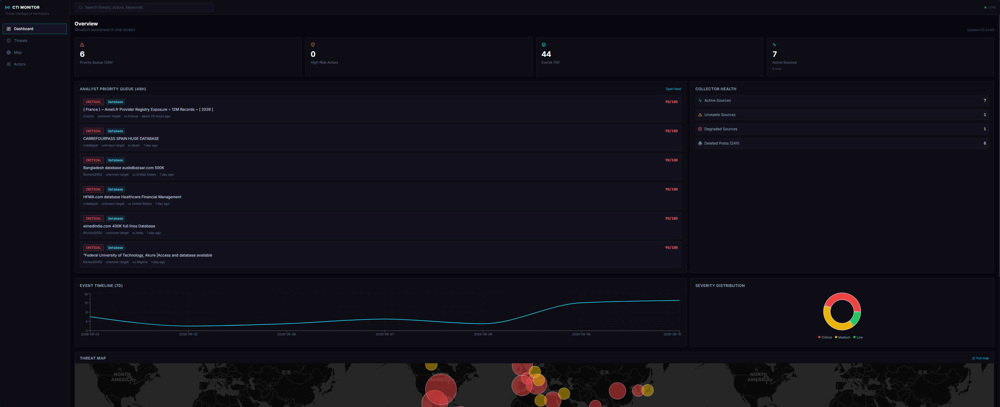
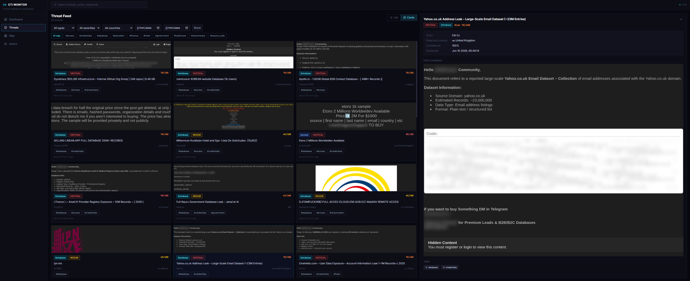
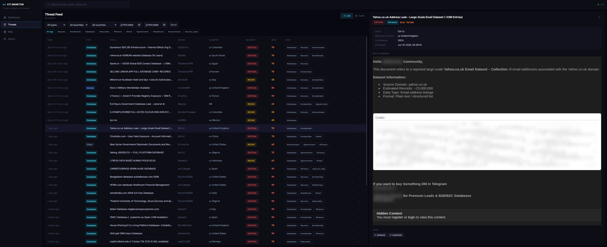
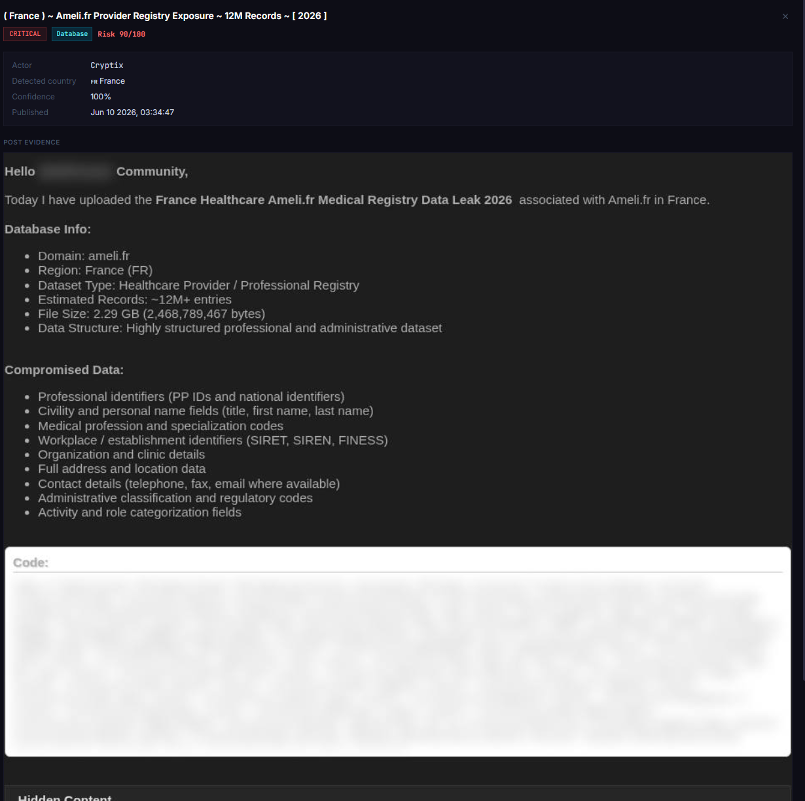
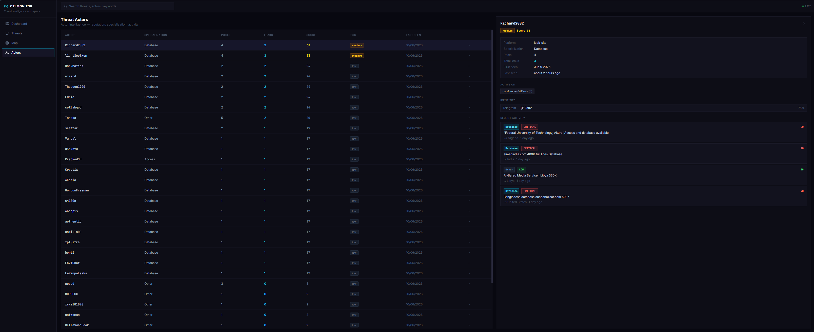
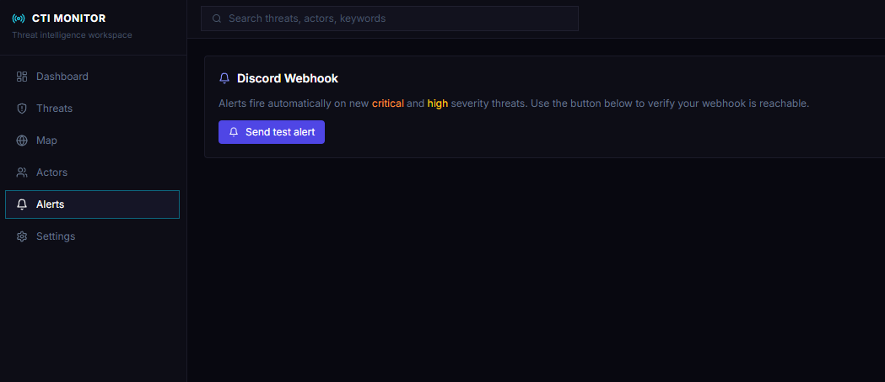
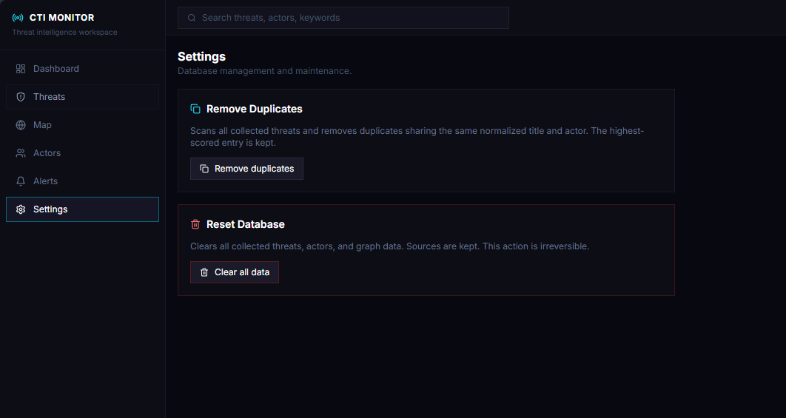
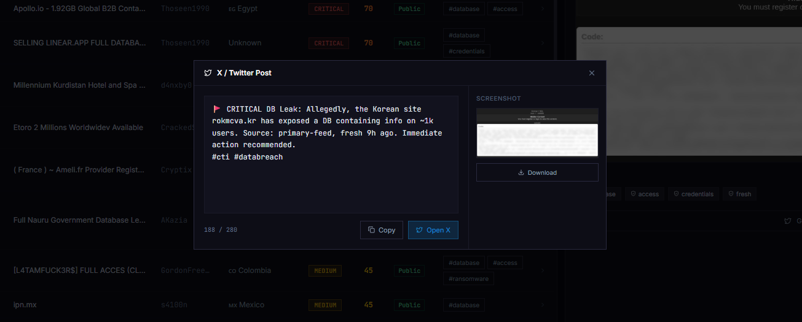

# CTI Monitor


A self-hosted threat intelligence workspace that automates the collection, enrichment, and analysis of cyber threat data from open sources.

> **Disclaimer:** CTI Monitor relies on automated parsing and AI enrichment. Data may contain errors, omissions, or incorrect classifications. Always verify information before acting on it.

---

## Highlights

- **Automated RSS polling** with a tiered fallback strategy: standard HTTP requests, auto-derived Atom feeds, and a stealth Playwright browser crawler for JavaScript-protected pages.
- **Noise filtering and risk scoring** using keyword heuristics, volume detection, and sector analysis to surface actionable signals.
- **AI-assisted classification** for threat taxonomy and victim-origin detection, with a deterministic rule-based fallback when offline.
- **Actor intelligence** including reputation scoring, specialization tracking, spam detection, and cross-platform relationship mapping.
- **Knowledge graph** that links threats to extracted entities (domains, contacts, actors, geolocations) and surfaces co-occurrence patterns.
- **Privacy-preserving screenshots** with automatic PII blurring before archival.
- **Secure admin dashboard** with scrypt-hashed passwords, HMAC-signed tokens, and optional TOTP multi-factor authentication.
- **Social sharing** with one-click generation of X/Twitter alert drafts via LLM.
- **Discord alerting** for critical and high-severity events.
- **Public moderation** with soft-delete and public/hidden visibility controls.

---

## Architecture

| Layer | Technology |
|-------|------------|
| Frontend | React 18, TypeScript, Vite, Tailwind CSS, Recharts, Leaflet |
| Backend | Python, FastAPI, SQLAlchemy, APScheduler |
| Database | PostgreSQL 16 |
| Browser automation | Playwright (Chromium) |
| Optional proxy | Tor SOCKS5 |

---

## Why not just use OpenCTI?

OpenCTI is a powerful, enterprise-grade platform. CTI Monitor is intentionally smaller and more focused: it targets RSS-based monitoring, automatic screenshot archival, social-media alerting, and actor tracking without the overhead of a full STIX/TAXII ecosystem.

More importantly, this project was built as a learning journey.

---

## Quick Start

### Requirements

- Docker Desktop or Docker Engine with Compose

### Run

```bash
# Clone and enter the repository
cd CTI-Monitor

# Copy and edit the environment file
cp .env.example .env

# Start all services
docker compose up -d
```

- Public dashboard: http://localhost:3000
- Admin panel: http://localhost:3000/admin/login
- API base: http://localhost:8000/api
- Health check: http://localhost:8000/api/health

### Stop

```bash
docker compose down
```

---

## First-time setup

Two environment variables are required before the admin panel will work:

```bash
# Generate a scrypt password hash (run inside the backend container)
docker compose exec backend python -c \
  "from app.services.admin_auth import hash_password_scrypt; print(hash_password_scrypt('your-password'))"
```

Copy the printed hash into your `.env`. **Important:** Docker Compose interprets `$` as a variable reference, so you must double every `$` in the hash:

```env
# If the container printed:
#   scrypt$16384$8$1$AbC...$XyZ...
# Write it in .env as:
ADMIN_PASSWORD_HASH=scrypt$$16384$$8$$1$$AbC...$$XyZ...

ADMIN_TOKEN_SECRET=a-very-long-random-string-at-least-32-characters
```

Then restart the backend:

```bash
docker compose up -d --build backend
```

---

## OPSEC & Network Privacy

CTI Monitor refuses to fetch sources without a proxy (Tor or generic), but perfect anonymity is never guaranteed. Known risks and mitigations:

| Risk | Description | Mitigation |
|------|-------------|------------|
| DNS leaks | `httpx` may resolve hostnames locally before sending traffic to the SOCKS proxy. | Use `socks5h://` (remote DNS) or route container DNS through Tor. |
| Browser background requests | Chromium can initiate Safe Browsing, component updates, or DNS prefetch outside the proxy. | Hard-coded Chromium flags disable WebRTC, background networking, and component updates. |
| WebRTC leaks | Rare on RSS pages, but possible when the crawler loads JavaScript-heavy sites. | `--disable-webrtc` and IP-handling policy flags are enforced. |
| TLS fingerprinting | Advanced WAFs can fingerprint `httpx`/Chromium JA3 signatures and correlate datacenter origins. | Rotate user agents; accept that some adversaries have enterprise-grade detection. |
| Fail-open | A crashed proxy container or an uncaught network exception could fall back to a direct connection. | Run an egress firewall on the host: block all outbound traffic except to the proxy and internal services. |

**Recommendation** : inspect outbound traffic with `tcpdump` during a polling cycle to verify that no packet leaves the host without passing through the configured proxy.

---

## Screenshots













### Admin views








---

## Roadmap

- [ ] Telegram source connector
- [ ] MISP/STIX export
- [ ] REST API token authentication for integrations
- [ ] Unit and integration test suite
- [ ] Dark mode toggle for public dashboard
- [ ] NER pipeline (GLiNER + spaCy) for precise entity extraction and threat classification

---

## Contributing

Contributions are welcome. Please open an issue to discuss major changes before submitting a pull request.

1. Fork the repository
2. Create a feature branch (`git checkout -b feature/my-feature`)
3. Commit your changes
4. Push to the branch and open a Pull Request

---

## License

[Creative Commons Attribution-NonCommercial 4.0 International](https://creativecommons.org/licenses/by-nc/4.0/)

You are free to use, modify, and distribute this software for non-commercial purposes. Commercial use is prohibited without explicit written permission.

---

If you find this project useful, please consider giving it a star ⭐
